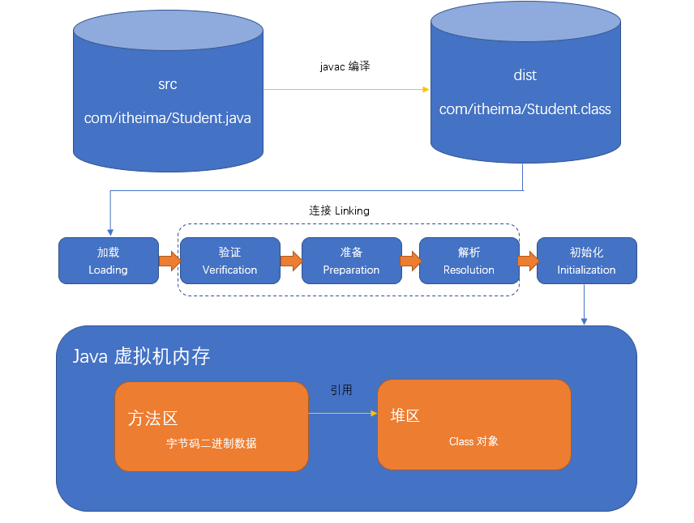
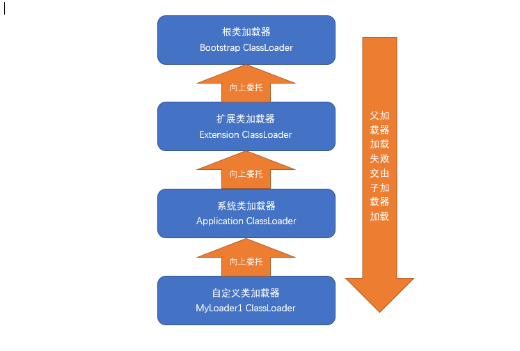
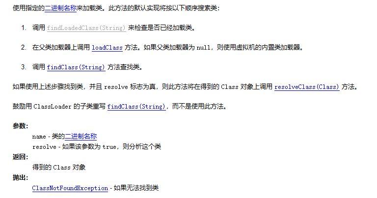
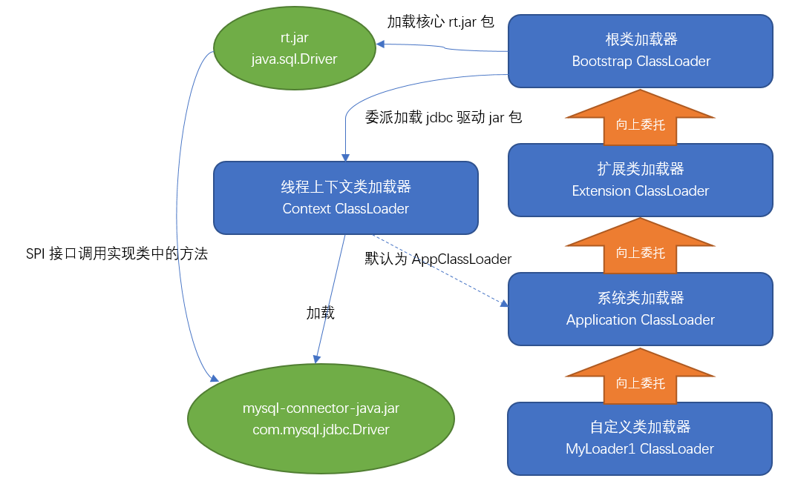
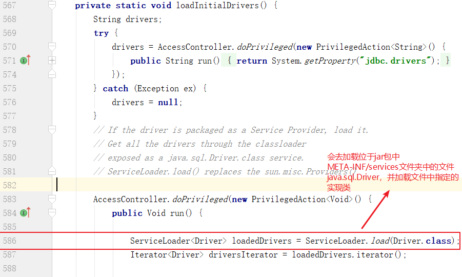
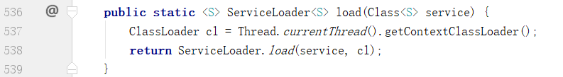

# 类的加载概述

​		我们编写的“.java”扩展名的源代码文件中存储着要执行的程序逻辑，这些文件需要经过java编译器编译成“.class”文件，".class"文件中存放着编译后虚拟机指令的二进制信息。当需要用到某个类时，虚拟机将会加载它，并在内存中创建对应的class对象，这个过程称之为类的加载。一个类的生命周期从类被加载、连接和初始化开始，只有在虚拟机内存中，我们的java程序才可以使用它。整个过程如下图所示： 




# 类的加载、连接和初始化

​		当Java程序中需要使用到某个类时，虚拟机会保证这个类已经被加载、连接和初始化。而连接又包含验证、准备和解析这三个子过程，这个过程必须严格的按照顺序执行。

## 类的加载

​		通过类的完全限定名（包名和类名）查找此类的字节码文件，把类的.class文件中的二进制数据读入到内存中，并存放在运行时数据区的方法区内。然后利用字节码文件创建一个Class对象，用来封装类在方法区内的数据结构并存放在堆区内。这个过程是由类加载器完成的，我们后面会进行详细讲解。

## 连接

- 验证：确保被加载类的正确性。class文件的字节流中包含的信息符合当前虚拟机要求，不会危害虚拟机自身安全。
- 准备：为类的静态变量分配内存，并将其初始化为默认值。此阶段仅仅只为静态类变量（即static修饰的字段变量）分配内存，并且设置该变量的初始值。（比如 static int num=5,这里只将num初始化为0，5的值将会在初始化时赋值）。对于final static修饰的变量，编译的时候就会分配了，也不会分配实例变量的内存。
- 解析：把类中的符号引用转换为直接引用。符号引用就是一组符号来描述目标，而直接引用就是直接指向目标的指针、相对偏移量或一个间接定位到目标的句柄。（可参考“虚拟机指令”相关内容）

## 初始化

​		类加载最后阶段，若该类具有父类，则先对父类进行初始化，执行静态变量赋值和静态代码块代码，成员变量也将被初始化。

# 类加载器

​		类的加载是由类加载器完成的。类加载器可以分为两种：第一种是Java虚拟机自带的类加载器，分别为启动类加载器、扩展类加载器和系统类加载器。第二种是用户自定义的类加载器，是java.lang.ClassLoader的子类实例。

## 虚拟机内置加载器

### 根类加载器（Bootstrap）

​		根类加载器是最底层的类加载器，是虚拟机的一部分，它是由C++语言实现的，且没有父加载器，也没有继承java.lang.ClassLoader类。它主要负责加载由系统属性“sun.boot.class.path”指定的路径下的核心类库（即\<JAVA_HOME\>\jre\lib），出于安全考虑，根类加载器只加载java、javax、sun开头的类。

```java
public static void main(String[] args) {
    ClassLoader cl = Object.class.getClassLoader();
    System.out.println(cl);//根类加载器打印出来的结果是null
}
```

### 扩展类加载器（Extension）

​		扩展类加载器是指由原SUN公司实现的sun.misc.Launcher$ExtClassLoader类（JDK9是jdk.internal.loader.ClassLoaders$PlatformClassLoader类），它是由java语言编写，父加载器是根类加载器。负责加载<JAVA_HOME>\jre\lib\ext目录下的类库或者系统变量"java.ext.dirs"指定的目录下的类库。

以下是ExtClassLoader加载目录源码：

```java
private static File[] getExtDirs() {
     String s = System.getProperty("java.ext.dirs");
     File[] dirs;
     if (s != null) {
         StringTokenizer st =
             new StringTokenizer(s, File.pathSeparator);
         int count = st.countTokens();
         dirs = new File[count];
         for (int i = 0; i < count; i++) {
             dirs[i] = new File(st.nextToken());
         }
     } else {
         dirs = new File[0];
     }
     return dirs;
 }
```

```java
public static void main(String[] args) {
    //DNSNameService类位于dnsns.jar包中，它存在于jre/lib/ext目录下
    ClassLoader cl = DNSNameService.class.getClassLoader();
    System.out.println(cl);//打印结果sun.misc.Launcher$ExtClassLoader
}
```


### 系统类加载器（System）

​		系统类加载器也称之为应用类加载器，也是纯java类，是原SUN公司实现的sun.misc.Launcher$AppClassLoader类（JDK9是jdk.internal.loader.ClassLoaders$AppClassLoader）。它的父加载器是扩展类加载器。它负责从classpath环境变量或者系统属性java.class.path所指定的目录中加载类。它是用户自定义的类加载器的默认父加载器。一般情况下，该类加载器是程序中默认的类加载器，可以通过ClassLoader.getSystemClassLoader()直接获得。

```java
public class ClassLoaderDemo {
    public static void main(String[] args) {
        //自己编写的类使用的类加载器
        ClassLoader classLoader = ClassLoaderDemo.class.getClassLoader();
        System.out.println(classLoader);//sun.misc.Launcher$AppClassLoader
    }
}
```

### 小结

​		在程序开发中，类的加载几乎是由上述3种类加载器相互配合执行的，同时我们还可以自定义类加载器。需要注意的是，Java虚拟机对class文件采用的是按需加载的方式，也就是说当需要使用该类时才会将它的class文件加载到内存生成class对象，而且加载某个类的class文件时，Java虚拟机采用的是双亲委派模式，即把加载类的请求交由父加载器处理，它一种任务委派模式。

## 类加载器的双亲委派机制

​		除了根类加载器之外，其他的类加载器都需要有自己的父加载器。从JDK1.2开始，类的加载过程采用双亲委派机制，这种机制能够很好的保护java程序的安全。除了虚拟机自带的根类加载器之外，其余的类加载器都有唯一的父加载器。比如，如果需要classLoader加载一个类时，该classLoader先委托自己的父加载器先去加载这个类，若父加载器能够加载，则由父加载器加载，否则才有classLoader自己加载这个类。即每个类加载器都很懒，加载类时都先让父加载器去尝试加载，一直到根类加载器，加载不到时自己才去加载。真正加载类的加载器我们叫做启动类加载器。注意，双亲委派机制的父子关系并非面向对象程序设计中的继承关系，而是通过使用组合模式来复用父加载器代码，这种机制如下图所示：



```java
public class ClassLoaderDemo1 {
    public static void main(String[] args) throws Exception{
        //演示类加载器的父子关系
        ClassLoader loader = ClassLoaderDemo1.class.getClassLoader();
        while(loader!=null){
            System.out.println(loader);
            loader = loader.getParent();
        }
    }
}
运行结果：
sun.misc.Launcher$AppClassLoader@18b4aac2
sun.misc.Launcher$ExtClassLoader@1b6d3586
```

使用双亲委派机制的好处：

1、可以避免类的重复加载，当父类加载器已经加载了该类时，就没有必要子ClassLoader再加载一次。

2、考虑到安全因素，java核心api中定义类型不会被随意替换，假设通过网络传递一个名为java.lang.Object的类，通过双亲委托模式传递到启动类加载器，而启动类加载器在核心Java API发现这个名字的类，发现该类已被加载，并不会重新加载网络传递的过来的java.lang.Object，而直接返回已加载过的Object.class，这样便可以防止核心API库被随意篡改。

```java
//定义一个类，注意包名
package java.lang;

public class MyObject {

}
//加载该类
public static void main(String[] args) {
    Class clazz = MyObject.class;
    System.out.println(clazz.getClassLoader());
}
//输出结果
Exception in thread "main" java.lang.SecurityException: Prohibited package name: java.lang
```

​		因为java.lang包属于核心包，只能由根类加载器进行加载，而根据类加载的双亲委派机制，根类加载器是加载不到这个MyObject类的（自定义的），所以只能由AppClassLoader进行加载，而这又不是允许的，所以会报出“Prohibited package name: java.lang”（禁止的包名）错误。

## ClassLoader

​		所有的类加载器（除了根类加载器）都必须继承java.lang.ClassLoader。它是一个抽象类，主要的方法如下：

### loadClass

​		在ClassLoader的源码中，有一个方法loadClass(String name,boolean resolve)，这里就是双亲委托模式的代码实现。从源码中我们可以观察到它的执行顺序。需要注意的是，只有父类加载器加载不到类时，会调用findClass方法进行类的查找，所以，在定义自己的类加载器时，不要覆盖掉该方法，而应该覆盖掉findClass方法。

```java
//ClassLoader类的loadClass源码
protected Class<?> loadClass(String name, boolean resolve)
        throws ClassNotFoundException
    {
        synchronized (getClassLoadingLock(name)) {
            // First, check if the class has already been loaded
            Class<?> c = findLoadedClass(name);
            if (c == null) {
                long t0 = System.nanoTime();
                try {
                    if (parent != null) {
                        c = parent.loadClass(name, false);
                    } else {
                        c = findBootstrapClassOrNull(name);
                    }
                } catch (ClassNotFoundException e) {
                    // ClassNotFoundException thrown if class not found
                    // from the non-null parent class loader
                }

                if (c == null) {
                    // If still not found, then invoke findClass in order
                    // to find the class.
                    long t1 = System.nanoTime();
                    c = findClass(name);

                    // this is the defining class loader; record the stats
                    sun.misc.PerfCounter.getParentDelegationTime().addTime(t1 - t0);
                    sun.misc.PerfCounter.getFindClassTime().addElapsedTimeFrom(t1);
                    sun.misc.PerfCounter.getFindClasses().increment();
                }
            }
            if (resolve) {
                resolveClass(c);
            }
            return c;
        }
    }
```




### findClass

​		在自定义类加载器时，一般我们需要覆盖这个方法，且ClassLoader中给出了一个默认的错误实现。

```java
protected Class<?> findClass(String name) throws ClassNotFoundException {
    throw new ClassNotFoundException(name);
}
```

### defineClass

​		该方法的签名如下。用来将byte字节解析成虚拟机能够识别的Class对象。defineClass()方法通常与findClass()方法一起使用。在自定义类加载器时，会直接覆盖ClassLoader的findClass()方法获取要加载类的字节码，然后调用defineClass()方法生成Class对象。

```
protected final Class<?> defineClass(String name,byte[] b,int off,int len)
                              throws ClassFormatError
```

### resolveClass

​		连接指定的类。类加载器可以使用此方法来连接类。

## URLClassLoader

​		在java.net包中，JDK提供了一个更加易用的类加载器URLClassLoader，它扩展了ClassLoader，能够从本地或者网络上指定的位置加载类。我们可以使用该类作为自定义的类加载器使用。

构造方法：

public URLClassLoader(URL[] urls)：指定要加载的类所在的URL地址，父类加载器默认为系统类加载器。

public URLClassLoader(URL[] urls, ClassLoader parent)：指定要加载的类所在的URL地址，并指定父类加载器。

案例1：加载磁盘上的类

```java
public static void main(String[] args) throws Exception{
		File file = new File("d:/");
		URI uri = file.toURI();
		URL url = uri.toURL();
        URLClassLoader classLoader = new URLClassLoader(new URL[]{url});
        System.out.println(classLoader.getParent());
        Class aClass = classLoader.loadClass("com.itheima.Demo");
        Object obj = aClass.newInstance();
    }
```

案例2：加载网络上的类

```java
public static void main(String[] args) throws Exception{
		URL url = new URL("http://localhost:8080/examples/");
        URLClassLoader classLoader = new URLClassLoader(new URL[]{url});
        System.out.println(classLoader.getParent());
        Class aClass = classLoader.loadClass("com.itheima.Demo");
        aClass.newInstance();
}
```


## 自定义类加载器

我们如果需要自定义类加载器，只需要继承ClassLoader类，并覆盖掉findClass方法即可。

### 自定义文件类加载器

```java
package com.itheima.base.classloader;

import sun.applet.Main;

import java.io.*;

public class MyFileClassLoader extends ClassLoader {
    private String directory;//被加载的类所在的目录

    /**
     * 指定要加载的类所在的文件目录
     * @param directory
     */
    public MyFileClassLoader(String directory,ClassLoader parent){
        super(parent);
        this.directory = directory;
    }
    protected Class<?> findClass(String name) throws ClassNotFoundException {
        try {
            //把类名转换为目录
            String file = directory+File.separator+name.replace(".", File.separator)+".class";
            //构建输入流
            InputStream in = new FileInputStream(file);
            //存放读取到的字节数据
            ByteArrayOutputStream baos = new ByteArrayOutputStream();
            byte buf[] = new byte[1024];
            int len = -1;
            while((len=in.read(buf))!=-1){
                baos.write(buf,0,len);
            }
            byte data[] = baos.toByteArray();
            in.close();
            baos.close();
            return defineClass(name,data,0,data.length);
        } catch (IOException e) {
            throw new RuntimeException(e);
        }
    }

    public static void main(String[] args) throws Exception {
        MyFileClassLoader myFileClassLoader = new MyFileClassLoader("d:/");
        Class clazz = myFileClassLoader.loadClass("com.itheima.Demo");
        clazz.newInstance();
    }
}

```

### 自定义网络类加载器

```java
package com.itheima.base.classloader;

import java.io.ByteArrayOutputStream;
import java.io.File;
import java.io.InputStream;
import java.net.MalformedURLException;
import java.net.URL;

public class MyURLClassLoader extends ClassLoader {
    private String url;

    public MyURLClassLoader(String url) {
        this.url = url;
    }

    protected Class<?> findClass(String name) throws ClassNotFoundException {
        try {
            String path = url+ "/"+name.replace(".","/")+".class";
            URL url = new URL(path);
            InputStream inputStream = url.openStream();
            ByteArrayOutputStream baos = new ByteArrayOutputStream();
            int len = -1;
            byte buf[] = new byte[1024];
            while((len=inputStream.read(buf))!=-1){
                baos.write(buf,0,len);
            }
            byte[] data = baos.toByteArray();
            inputStream.close();
            baos.close();
            return defineClass(name,data,0,data.length);
        } catch (Exception e) {
            e.printStackTrace();
        }
        return null;
    }

    public static void main(String[] args) throws Exception{
        MyURLClassLoader classLoader = new MyURLClassLoader("http://localhost:8080/examples");
        Class clazz = classLoader.loadClass("com.itheima.Demo");
        clazz.newInstance();
    }
}

```


### 热部署类加载器

​		当我们调用loadClass方法加载类时，会采用双亲委派模式，即如果类已经被加载，就从缓存中获取，不会重新加载。如果同一个class被同一个类加载器多次加载，则会报错。因此，我们要实现热部署让同一个class文件被不同的类加载器重复加载即可。但是不能调用loadClass方法，而应该调用findClass方法，避开双亲委托模式，从而实现同一个类被多次加载，实现热部署。

```java
MyFileClassLoader myFileClassLoader1 = new MyFileClassLoader("d:/",null);
MyFileClassLoader myFileClassLoader2 = new MyFileClassLoader("d:/",myFileClassLoader1);
Class clazz1 = myFileClassLoader1.loadClass("com.itheima.Demo");
Class clazz2 = myFileClassLoader2.loadClass("com.itheima.Demo");
System.out.println("class1:"+clazz1.hashCode());
System.out.println("class2:"+clazz2.hashCode());
结果:class1和class2的hashCode一致

MyFileClassLoader myFileClassLoader1 = new MyFileClassLoader("d:/",null);
MyFileClassLoader myFileClassLoader2 = new MyFileClassLoader("d:/",myFileClassLoader1);
Class clazz3 = myFileClassLoader1.findClass("com.itheima.Demo");
Class clazz4 = myFileClassLoader2.findClass("com.itheima.Demo");
System.out.println("class3:"+clazz3.hashCode());
System.out.println("class4:"+clazz4.hashCode());
结果：class1和class2的hashCode不一致
```


## 类的显式与隐式加载

​		类的加载方式是指虚拟机将class文件加载到内存的方式。

​		显式加载是指在java代码中通过调用ClassLoader加载class对象，比如Class.forName(String name)；this.getClass().getClassLoader().loadClass()加载类。

​		隐式加载指不需要在java代码中明确调用加载的代码，而是通过虚拟机自动加载到内存中。比如在加载某个class时，该class引用了另外一个类的对象，那么这个对象的字节码文件就会被虚拟机自动加载到内存中。

## 线程上下文类加载器

​		在Java中存在着很多的服务提供者接口SPI，全称Service Provider Interface，是Java提供的一套用来被第三方实现或者扩展的API，这些接口一般由第三方提供实现，常见的SPI有JDBC、JNDI等。这些SPI的接口（比如JDBC中的java.sql.Driver）属于核心类库，一般存在rt.jar包中，由根类加载器加载。而第三方实现的代码一般作为依赖jar包存放在classpath路径下，由于SPI接口中的代码需要加载具体的第三方实现类并调用其相关方法，SPI的接口类是由根类加载器加载的，Bootstrap类加载器无法直接加载位于classpath下的具体实现类。由于双亲委派模式的存在，Bootstrap类加载器也无法反向委托AppClassLoader加载SPI的具体实现类。在这种情况下，java提供了线程上下文类加载器用于解决以上问题。

线程上下文类加载器可以通过java.lang.Thread的getContextClassLoader()来获取，或者通过setContextClassLoader(ClassLoader cl)来设置线程的上下文类加载器。如果没有手动设置上下文类加载器，线程将继承其父线程的上下文类加载器，初始线程的上下文类加载器是系统类加载器（AppClassLoader），在线程中运行的代码可以通过此类加载器来加载类或资源。

显然这种加载类的方式破坏了双亲委托模型，但它使得java类加载器变得更加灵活。



​		我们以JDBC中的类为例做一下说明。在JDBC中有一个类java.sql.DriverManager，它是rt.jar中的类，用来注册实现了java.sql.Driver接口的驱动类，而java.sql.Driver的实现类一般都是位于数据库的驱动jar包中的。

java.sql.DriverManager的部分源码截图：




java.util.ServiceLoader的部分源码截图：

